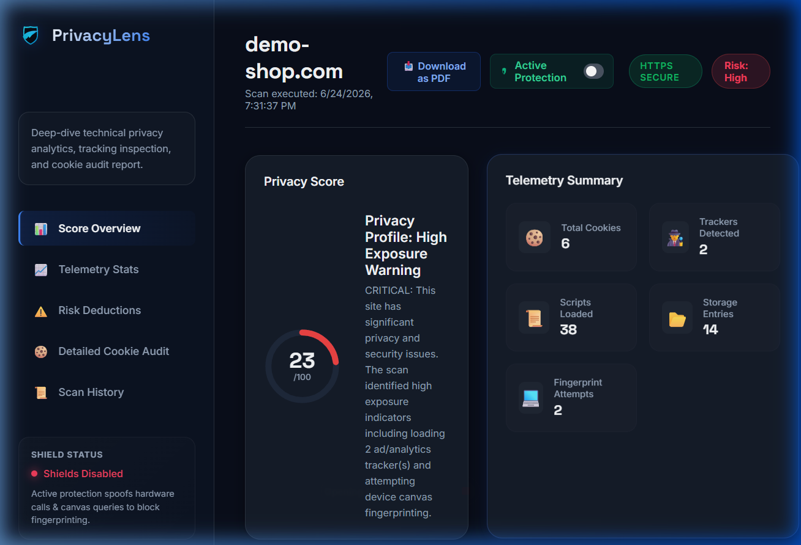
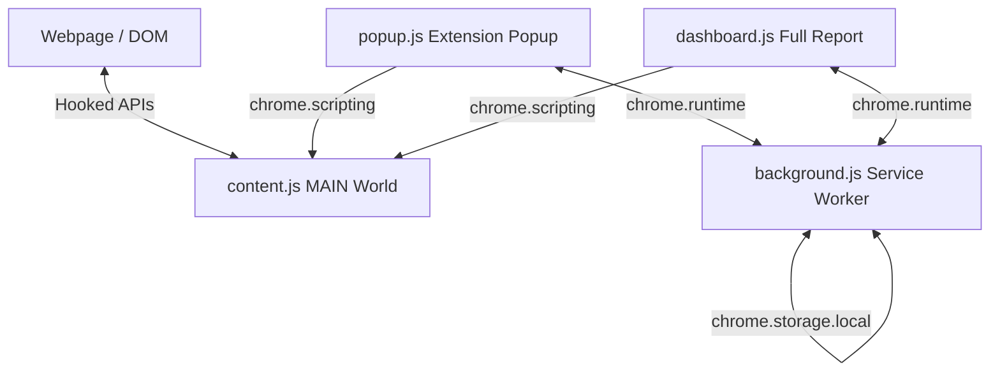

# PrivacyLens 🛡️

> **Know what websites know about you.** A modern, high-performance Chrome extension designed to scan webpages for tracking telemetry, audit cookies, and spoof profiling APIs in real-time to defend against device fingerprinting.

## 📸 Dashboard Preview



---

## 🌟 Key Features

### 1. Active Protection Shields
- **Canvas Protection**: Adds sub-perceptual noise to canvas reads (`toDataURL`, `getImageData`) to disrupt canvas-based tracking hashes without breaking visual layouts.
- **Hardware/System Spoofing**: Obfuscates system characteristics like `navigator.hardwareConcurrency`, `navigator.deviceMemory`, and active browser plugins.
- **Screen Coordinate Masking**: Standardizes screen metrics (`width`, `height`, `colorDepth`, `pixelDepth`) to generic dimensions (e.g. 1920x1080) to prevent viewport profiling.
- **Clipboard Hijacking Blocker**: Detects and blocks malicious scripts trying to write to the system clipboard without explicit user interaction.
- **WebGL Interception**: Logs WebGL pixel read attempts (`readPixels`) to monitor 3D graphics profiling.

### 2. Telemetry Scanner
- **Privacy Scoring**: Computes a dynamic score (0 to 100) based on page protocol (HTTPS/HTTP), third-party tracking beacons, cookie load sizes, and script counts.
- **Script Tracker Signatures**: Identifies popular advertising/analytics script networks like Google Tag Manager, Facebook Pixel, Google Analytics, Hotjar, Hubspot, and others.

### 3. SaaS-style Analytics Dashboard
- **Cookie Audit Table**: Inspects, searches, and categorizes cookies (Tracker, Essential, Utility).
- **Tracker Purging**: Lets users instantly clear tracking cookies with one click while keeping essential login sessions alive.
- **Scan History**: Retains past scan history locally to help users track website profiles over time.
- **PDF Report Exporters**: Supports printing clean, landscape-optimized analytical reports for audits.

---

## 🛠️ Architecture & Under the Hood

PrivacyLens is built on **Manifest V3** and utilizes a multi-layered script model:


- **`content.js` (MAIN World, runs at `document_start`)**: Injected directly into the website's execution context. This allows it to hook JavaScript prototype getters/setters before the webpage's own scripts load.
- **`popup.js` (Popup Interface)**: Provides a quick view of the active tab's privacy score and toggles shields.
- **`dashboard.js` (Dashboard Tab)**: Renders deep analytical graphs, lists, scan history, and manages cookie purge operations. Synchronizes state updates in real-time using `chrome.storage.onChanged`.
- **`background.js` (Service Worker)**: Serves as the persistent database agent, coordinating local storage changes and caching historical scan statistics.

---

## 🚀 Installation & Local Setup

Since PrivacyLens is currently in development, you can load and run it locally as an unpacked extension:

1. Clone or download this repository to your machine.
2. Open Google Chrome and navigate to `chrome://extensions/`.
3. In the top-right corner, toggle **Developer mode** to **ON**.
4. Click the **Load unpacked** button in the top-left corner.
5. Select the root folder of this repository (the folder containing `manifest.json`).
6. The PrivacyLens icon will appear in your extension bar. Pin it and start browsing!

---

## 📂 Project Structure

```bash
PrivacyLens/
├── manifest.json       # Extension configuration & MV3 permission gates
├── background.js       # Background service worker (state cache and APIs)
├── content.js          # Main world runtime hooks (API spoofing & telemetry)
├── icons/              # Brand graphic assets and logo files
│   └── icon.svg        # Rebranded Royal Blue/Indigo vector logo
├── popup/              # Chrome extension dropdown interface
│   ├── popup.html
│   ├── popup.css
│   └── popup.js
└── dashboard/          # Comprehensive reporting interface
    ├── dashboard.html
    ├── dashboard.css
    └── dashboard.js
```

---

## 📄 License

This project is licensed under the MIT License - see the LICENSE file for details.
