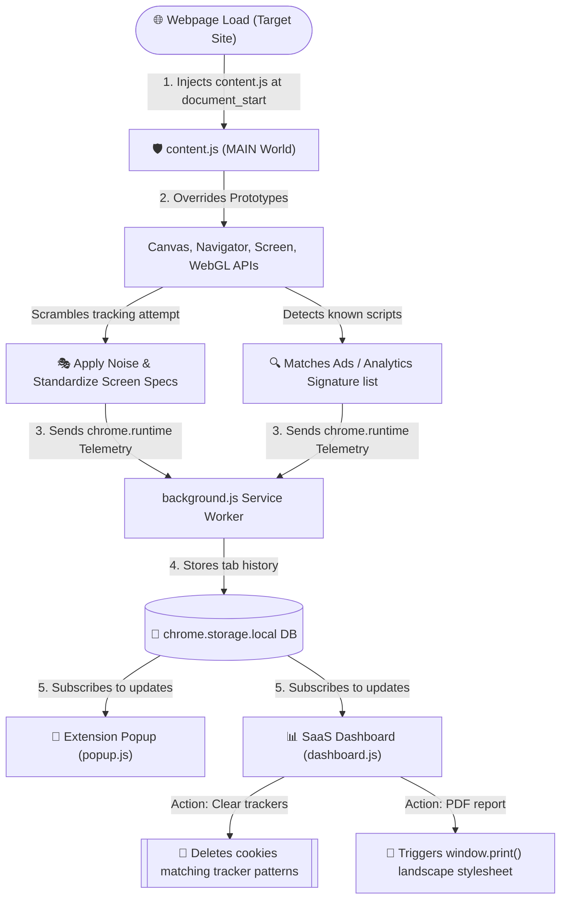
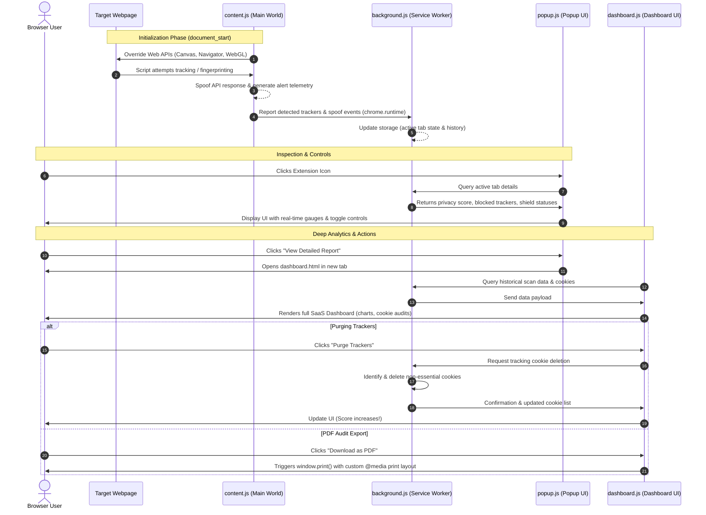

# PrivacyLens 🛡️

> **Know what websites know about you.** A modern, SaaS-style high-performance Chrome extension designed to scan webpages for tracking telemetry, audit cookies, and spoof profiling APIs in real-time to defend against device fingerprinting.

---

## 📸 Interface Showcase

### 1. SaaS-style Analytics Dashboard (`dashboard_img_1`)
The full-page dashboard compiles real-time cookie audits, history logs, and tracker category details into an interactive analytical layout.


---

### 2. Extension Popup UI (`extension_img_2`)
The browser action popup provides a rapid diagnostic view of the active tab's safety rating, running shields, and quick toggle controls.

<p align="left">
  
</p>

---

## 🌟 Core Features & Highlights

### 📋 Deep Feature Highlights

| Feature | Description | Key Highlight |
| :--- | :--- | :--- |
| **📥 PDF Audit Reports** | Exports the entire SaaS analytics dashboard into a clean, landscape-optimized audit report format. | **One-click print/PDF save with tailored styling!** |
| **🧹 Tracker Purging** | Instantly purges non-essential advertising and analytics cookies without disturbing active user logins. | **Intelligent cookie classifier!** |
| **🎭 Canvas Spoofing** | Injects sub-perceptual noise into `<canvas>` pixel read API methods to scramble browser fingerprint signatures. | **Zero layout disruption!** |
| **🛡️ WebGL & System Obfuscation** | Spoofs navigator attributes like hardware cores, memory size, and logs raw WebGL telemetry probes. | **Anti-fingerprinting engine!** |
| **📊 Dynamic Privacy Scoring** | Computes a real-time score (0 to 100) reflecting tracking hazards, SSL usage, and cookie payloads. | **Color-coded threat dials!** |

---

### 🛡️ Detailed Features Breakdown

#### 1. Real-time Telemetry & API Spoofing
*   **Anti-Fingerprinting Engine**: Intercepts canvas pixel retrieval (`toDataURL`, `getImageData`) and applies slight noise modifications to randomize hashing.
*   **WebGL Read Detection**: Hooks WebGL pixel reading arrays to alert users when scripts probe graphical processing details.
*   **System Attribute Masking**: Spoofs `navigator.deviceMemory`, `navigator.hardwareConcurrency`, and screen specifications to standardize standard specifications (e.g., 1920x1080 resolution).
*   **Clipboard Safeguard**: Intercepts automated copy-to-clipboard commands to prevent websites from hijacking clipboard content.

#### 2. Advanced Cookie & Purging Engine
*   **Audit Table**: Grouping and sorting of cookies into Tracker, Essential, and Utility categories based on tracking patterns.
*   **Targeted Cookie Purge**: Destroys cookies identified as analytics/advertising trackers, instantly restoring local state privacy.
*   **Persistence & History**: Local tracking historical logs stored securely inside the browser (`chrome.storage.local`).

#### 3. 📥 Landscape-Optimized PDF Report Export
*   **Instant Export**: Generate portable audit documents using the `Download as PDF` button.
*   **Custom Print Engine CSS**: Clean print-media queries hide navigation components and optimize layout formatting, offering high-fidelity hardcopies.

---

## 🔄 Dynamic Data & Execution Flow

To protect user privacy seamlessly, PrivacyLens coordinates execution across multiple Sandboxed Worlds:

### 1. Architectural Runtime Flow
This flowchart maps the initialization of API hooks and how telemetry events flow from the DOM to the User Interfaces.



### 2. Lifespan Sequence Diagram
The sequential messaging between components during page browsing and user actions:



---

## 🚀 Installation & Local Setup

Since PrivacyLens is loaded locally as an unpacked extension:

1. Clone or download this repository.
2. Open Google Chrome and navigate to `chrome://extensions/`.
3. Toggle **Developer mode** in the top-right corner to **ON**.
4. Click **Load unpacked** in the top-left corner.
5. Select the root folder of this repository (the folder containing `manifest.json`).
6. Pin PrivacyLens to your extension bar and begin browsing securely!

---

## 📂 Project Structure

```bash
PrivacyLens/
├── manifest.json       # Extension configuration & MV3 permission gates
├── background.js       # Background service worker (state cache and APIs)
├── content.js          # Main world runtime hooks (API spoofing & telemetry)
├── assets/             # Extension & Dashboard preview screenshots
│   ├── Dashboard_img 1.png
│   ├── Dashboard_img 2.png
│   ├── Dashboard_img 3.png
│   ├── extension_img 1.png
│   └── extension_img 2.png
├── icons/              # Brand graphic assets and logo files
│   └── icon.svg        # Rebranded Royal Blue/Indigo vector logo
├── popup/              # Chrome extension dropdown interface
│   ├── popup.html
│   ├── popup.css
│   └── popup.js
└── dashboard/          # Comprehensive reporting interface
    ├── dashboard.html
    ├── dashboard.css
    └── dashboard.js
```

---

## 📄 License

This project is licensed under the MIT License.

